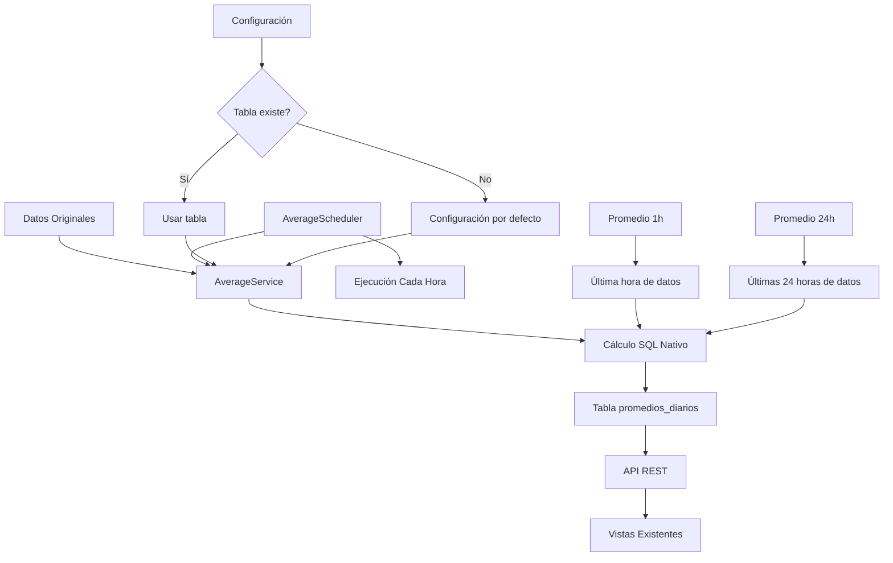

# Sistema de Promedios Diarios - SQM API

## Descripción General

El sistema de promedios diarios calcula automáticamente promedios por hora y diarios de variables ambientales (SO₂, PM2.5, PM10) para todas las estaciones configuradas. Los promedios se calculan cada hora y se almacenan como registros históricos completos, manteniendo la hora exacta de cálculo. La API devuelve siempre los valores más recientes para alimentar las vistas existentes.

### Características del Sistema
- **Cálculo cada hora**: Promedios por hora y diarios se calculan automáticamente
- **Promedio diario**: Valor principal que se muestra en la plataforma (promedio de 24 horas del día)
- **Promedio por hora**: Se almacena para análisis pero no es el valor principal
- **Lógica de ceros**: Si no hay datos en una hora, se cuenta como 0 en el promedio diario
- **Construcción progresiva**: El promedio diario se va construyendo hora a hora
- **Historial completo**: Cada cálculo se almacena como un nuevo registro
- **Hora de cálculo**: Se registra la hora exacta cuando se realizó el promedio
- **Valores más recientes**: La API siempre devuelve los últimos promedios calculados
- **Auditoría completa**: Mantiene historial completo para análisis posterior
- **Precisión alta**: Todos los valores se muestran con 4 decimales para mayor precisión
- **Configuración por defecto**: Funciona con configuración predefinida si no existe tabla de configuración

## Configuración de Estaciones

| Estación | Variables | Descripción |
|----------|-----------|-------------|
| E1 | SO₂, PM2.5, PM10 | Mejillones |
| E2 | SO₂, PM2.5 | Sierra Gorda |
| E4 | SO₂, PM2.5 | Maria Elena |
| E5 | PM10 | HOSPITAL |
| E6 | PM10, SO₂ | Huara |
| E7 | PM10, SO₂, PM2.5 | Victoria |
| E8 | PM10, SO₂, PM2.5 | Colonia Pintados |
| E9 | PM10, SO₂, PM2.5 | Estación 9 |
| E10 | PM10, PM2.5 | Estación 10 |

## Instalación

### 1. Crear Tablas en Base de Datos

Ejecutar el archivo `database_structure.sql` directamente en MySQL:

```sql
-- Copiar y ejecutar el contenido de database_structure.sql
```

**Nota**: Si la tabla `configuracion_variables_estacion` no existe, el sistema utilizará automáticamente una configuración por defecto predefinida.

### 2. Probar el Sistema

```bash
# Desde el directorio server
node tests/testAveragesEndpoint.js
```

### 3. Reiniciar el Servidor

El scheduler se activará automáticamente al reiniciar el servidor.

## API Endpoints

### Obtener Todos los Promedios
```http
GET /api/promedios
```

**Respuesta:**
```json
{
  "success": true,
  "data": {
    "E1": {
      "SO2": {
        "valor": "48.0989",
        "promedioHora": "62.7445",
        "promedioDiario": "48.0989",
        "fechaCreacion": "2025-07-30T03:36:49.000Z",
        "horaCalculo": "23:36:48"
      },
      "PM2_5": {
        "valor": "12.8563",
        "promedioHora": "11.4132",
        "promedioDiario": "12.8563",
        "fechaCreacion": "2025-07-30T03:36:49.000Z",
        "horaCalculo": "23:36:48"
      },
      "PM10": {
        "valor": "37.0942",
        "promedioHora": "42.3108",
        "promedioDiario": "37.0942",
        "fechaCreacion": "2025-07-30T03:36:50.000Z",
        "horaCalculo": "23:36:48"
      }
    }
  },
  "timestamp": "2025-07-30T03:41:33.543Z"
}
```

### Obtener Promedios por Estación
```http
GET /api/promedios/estacion/E1
```

### Ejecutar Cálculo Manual
```http
POST /api/promedios/calcular
```

## Uso en Vistas Existentes

### EstacionesDashboard
```javascript
import { fetchAveragesData } from '../services/api';

// Obtener promedios diarios
const [averagesData, setAveragesData] = useState({});

useEffect(() => {
    const loadAverages = async () => {
        const response = await fetchAveragesData();
        if (response.success) {
            setAveragesData(response.data);
        }
    };
    loadAverages();
}, []);

// Mostrar promedio diario como valor principal (con 4 decimales)
const getPromedioSO2 = (station) => {
    const stationAverages = averagesData.data ? averagesData.data[station] : null;
    if (!stationAverages || !stationAverages.SO2) return null;
    return parseFloat(stationAverages.SO2.valor); // Convertir string a número
};

// En el JSX
{getPromedioSO2(cfg.station) ? getPromedioSO2(cfg.station).toFixed(4) : 'Sin Datos'}
```

### SQM Grup1 y SQM Grup2
```javascript
// Obtener promedios para estaciones específicas
const stationAverages = await fetchStationAverages('E1');
const so2Average = stationAverages.data.find(p => p.variable_name === 'SO2')?.promedio_dia; // promedio diario

// Mostrar con 4 decimales
const so2Value = parseFloat(so2Average).toFixed(4);
```

## Estructura de Base de Datos

### Tabla: `promedios_diarios`
```sql
CREATE TABLE promedios_diarios (
    id INT AUTO_INCREMENT PRIMARY KEY,
    fecha DATE NOT NULL,
    hora_calculo TIME NOT NULL,
    station_name VARCHAR(100) NOT NULL,
    variable_name VARCHAR(100) NOT NULL,
    promedio_hora DECIMAL(10,4) NULL,
    promedio_dia DECIMAL(10,4) NULL,
    cantidad_registros INT DEFAULT 0,
    fecha_creacion TIMESTAMP DEFAULT CURRENT_TIMESTAMP,
    INDEX idx_fecha_hora (fecha, hora_calculo),
    INDEX idx_station_variable (station_name, variable_name),
    INDEX idx_fecha_creacion (fecha_creacion)
);
```

### Tabla: `configuracion_variables_estacion` (Opcional)
```sql
CREATE TABLE configuracion_variables_estacion (
    id INT AUTO_INCREMENT PRIMARY KEY,
    station_name VARCHAR(100) NOT NULL,
    variable_name VARCHAR(100) NOT NULL,
    activo BOOLEAN DEFAULT TRUE,
    fecha_creacion TIMESTAMP DEFAULT CURRENT_TIMESTAMP,
    UNIQUE KEY unique_station_variable (station_name, variable_name)
);
```

**Nota**: Si esta tabla no existe, el sistema utiliza automáticamente la configuración por defecto predefinida.

## Componentes del Sistema

### 1. AverageService (`server/services/averageService.js`)
- Cálculo de promedios por hora y diarios
- Consultas optimizadas a la base de datos
- Manejo de configuración por estación
- Configuración por defecto cuando no existe tabla de configuración

### 2. AverageScheduler (`server/services/averageScheduler.js`)
- Ejecución automática cada hora
- Manejo de errores y reintentos

### 3. AverageController (`server/controllers/averageController.js`)
- Endpoints REST para consulta de datos
- Formateo de respuestas para el frontend
- Manejo robusto de errores de inicialización

## Flujo de Datos



## Lógica de Cálculo

### Promedio por Hora
- **Período**: Última hora desde el momento del cálculo
- **Uso**: Análisis de tendencias a corto plazo
- **Fórmula**: `AVG(valor) WHERE timestamp >= NOW() - INTERVAL 1 HOUR`
- **Precisión**: 4 decimales

### Promedio Diario (Valor Principal)
- **Período**: 24 horas del día actual (00:00 a 23:59)
- **Uso**: Valor que se muestra en la plataforma
- **Lógica**: Promedio de las 24 horas del día, donde horas sin datos = 0
- **Construcción**: Se va construyendo hora a hora durante el día
- **Precisión**: 4 decimales

#### Ejemplo Detallado:
Supongamos que tenemos datos de SO2 para el día 15 de enero:

**01:00** (Primera hora del día):
- Promedio 00-01: 25.0000 µg/m³
- Horas 01-23: 0.0000 (sin datos)
- **Promedio diario**: (25.0000 + 0.0000×23) ÷ 24 = 1.0417 µg/m³

**02:00** (Segunda hora):
- Promedio 00-01: 25.0000 µg/m³
- Promedio 01-02: 30.0000 µg/m³
- Horas 02-23: 0.0000 (sin datos)
- **Promedio diario**: (25.0000 + 30.0000 + 0.0000×22) ÷ 24 = 2.2917 µg/m³

**10:00** (Décima hora):
- Promedios 00-01 a 09-10: [25.0000, 30.0000, 28.0000, 32.0000, 35.0000, 40.0000, 38.0000, 42.0000, 45.0000, 50.0000]
- Horas 10-23: 0.0000 (sin datos)
- **Promedio diario**: (25.0000+30.0000+28.0000+32.0000+35.0000+40.0000+38.0000+42.0000+45.0000+50.0000+0.0000×14) ÷ 24 = 12.7083 µg/m³

**23:00** (Última hora):
- Todas las horas del día tienen su promedio calculado
- **Promedio diario**: Promedio real de las 24 horas del día

## Pruebas

### Probar Endpoint
```bash
# Probar todos los promedios
curl http://localhost:3000/api/promedios

# Probar estación específica
curl http://localhost:3000/api/promedios/estacion/E1

# Ejecutar cálculo manual
curl -X POST http://localhost:3000/api/promedios/calcular
```

### Verificar en Base de Datos
```sql
-- Ver promedios calculados (más recientes primero)
SELECT * FROM promedios_diarios 
ORDER BY fecha DESC, hora_calculo DESC, station_name 
LIMIT 10;

-- Ver configuración (si existe la tabla)
SELECT * FROM configuracion_variables_estacion ORDER BY station_name, variable_name;

-- Ver historial de promedios para una estación específica
SELECT fecha, hora_calculo, variable_name, promedio_hora, promedio_dia 
FROM promedios_diarios 
WHERE station_name = 'E1' 
ORDER BY fecha DESC, hora_calculo DESC;

-- Ver evolución del promedio diario a lo largo del día
SELECT hora_calculo, variable_name, promedio_dia as promedio_diario
FROM promedios_diarios 
WHERE station_name = 'E1' AND fecha = CURDATE()
ORDER BY hora_calculo ASC;
```

## Troubleshooting

### Problemas Comunes

1. **No se calculan promedios**
   - Verificar que las tablas existen
   - Revisar configuración de variables
   - Ejecutar cálculo manual: `POST /api/promedios/calcular`
   - Verificar logs del servidor para errores de inicialización

2. **Datos faltantes**
   - Verificar que hay datos originales en tabla `datos`
   - Comprobar configuración de estaciones
   - Revisar zona horaria (America/Santiago)

3. **Errores de API**
   - Verificar que el servidor esté ejecutándose
   - Revisar logs del servidor
   - Comprobar rutas en `apiRoutes.js`
   - Verificar inicialización de AverageService

4. **Frontend muestra "Sin Datos"**
   - Verificar que la API devuelve datos correctamente
   - Comprobar acceso a `averagesData.data[station]` en lugar de `averagesData[station]`
   - Asegurar conversión de string a número con `parseFloat()`

5. **Tabla de configuración no existe**
   - El sistema funciona automáticamente con configuración por defecto
   - No es necesario crear la tabla `configuracion_variables_estacion`
   - Si se desea personalizar, crear la tabla y agregar configuraciones

### Diagnóstico del Sistema

Para diagnosticar problemas, ejecutar dentro del contenedor Docker:

```bash
# Diagnosticar sistema completo
node scripts/diagnoseAverages.js

# Verificar configuración
node tests/checkAveragesConfig.js

# Probar endpoint
node tests/testAveragesEndpoint.js
```

## Integración con Vistas Existentes

El sistema está diseñado para integrarse fácilmente con las vistas existentes:

- **EstacionesDashboard**: Reemplazar valores individuales por promedios diarios con 4 decimales
- **SQM Grup1/Grup2**: Usar promedios para cálculos y visualizaciones con alta precisión
- **Otras vistas**: Acceder a promedios a través de la API

Los endpoints devuelven datos en formato JSON compatible con las estructuras existentes, con valores como strings que deben convertirse a números con `parseFloat()` antes de mostrar.

### Cambios Recientes

- **Precisión aumentada**: Todos los valores se muestran con 4 decimales (`.toFixed(4)`)
- **Configuración por defecto**: Sistema funciona sin tabla de configuración
- **Manejo robusto de errores**: Mejor gestión de errores de inicialización
- **Conversión de tipos**: Manejo correcto de strings a números en frontend 